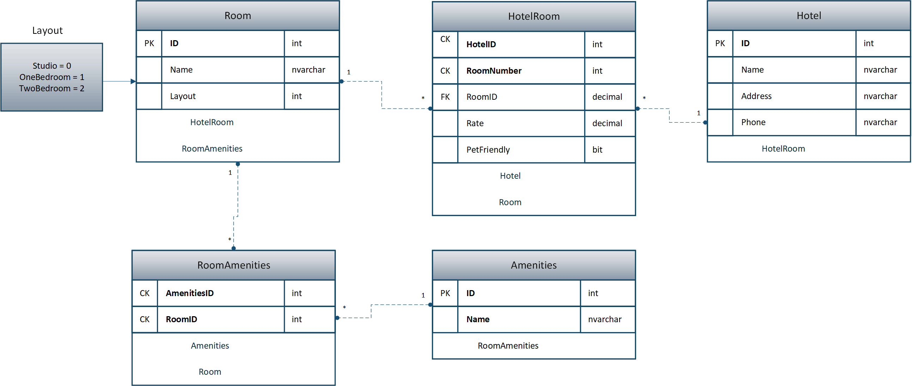

# Async-Inn
Basic MVC app for a hotel management system. Created for Code Fellows Code 401 to practice MVC and EF Core.

## Installation/Usage
Clone the repository, open the AsyncInn solution in Visual Studio, and run IIS Express. This should open the website in your browser.

## Example Usage
**1. The user sees the home page with links to pages for managing things like Hotels, Room, and Amenities**

**2. Clicking on an option on the Home page takes the user to a main page for that option.
Below is the main page for Hotels. As shown, the user can Create a new hotel, return home, or edit/view detail/delete a Hotel**

**3. Creating a Hotel brings the user to a form to fill out**

**4. Editing a Hotel brings the user to a form for editing**

**5. A user can also view a particular Hotel's details**

**6. Finally, a user can delete a hotel**

## Schema

### Tables:
  * **Hotels**: Hotels can have multiple rooms and are connected to those rooms through the HotelRoom table.
  * **Rooms**: Rooms are not specific rooms, but more like room types. Thus, a Hotel can have multiple Rooms, and a Room can
  belong to many Hotel locations. Rooms are related to Hotels through the HotelRoom table.
  * **Amenities**: The Amenities table holds room features like AC, Coffee maker, etc. An amenity type can belong to many different
  rooms, and a room can have many different amenities. This many:many relationship is captured in the RoomAmenities join table.
  * **RoomAmenities**: This is a pure join table with a composite key of RoomID & AmenitiesID. It joins Rooms with Amenities. Since RoomAmenities composite key consists of RoomID and AmenitiesID, a single Room can only ever have 1 of a single type of amenity. Likewise, a single amenity can only ever be applied to a particular room once (e.g., a room cannot have two coffee makers).
  * **HotelRoom**: This is an entity join table with a composite key of HotelID and RoomNumber. This ensures that a room with the same number, say "room 123" can exist at multiple hotel locations. This table also includes payload to associate with each Room/Hotel combination. The payload includes price (for example, the "Deluxe Suite" room type may cost $200/night in one location, but $250/night at another location), and an indication of pet friendliness.
